# UBUNTU VM #

## 1. Analysis ##
* **Given:** A `ubuntu2004_1.vdi`.
* **Hint:** binary exploitation on something leads to rce -> attackers start doing post exploiting things

## 2. Investigation ##
- **Notes:** I started investigating this vm quite late so I got a hint that helped me a lot to narrow down the thinking path. However I will still write down how I approach the vm in the most complete way.
- I was given a `.vdi` virtual disc, first I ran:
```bash
file ubuntu2004_1.vd
```
- It gave me something like QEMU VM Virtual Disk Image, so I needed to convert it to the `.vmdk` to upload it to my `VMware Workstation` by this command:
```bash
# sudo apt install qemu-utils
qemu-img convert ubuntu2004_1.vdi -O vmdk task.vmdk
```
- After convert it to `.vmdk` format, I create a new virtual machine in VMware to import the disc to, from the name I knew it a `Ubuntu` disc.
- After importing and starting the machine, it asked me the `username/password` which is `student/password`:

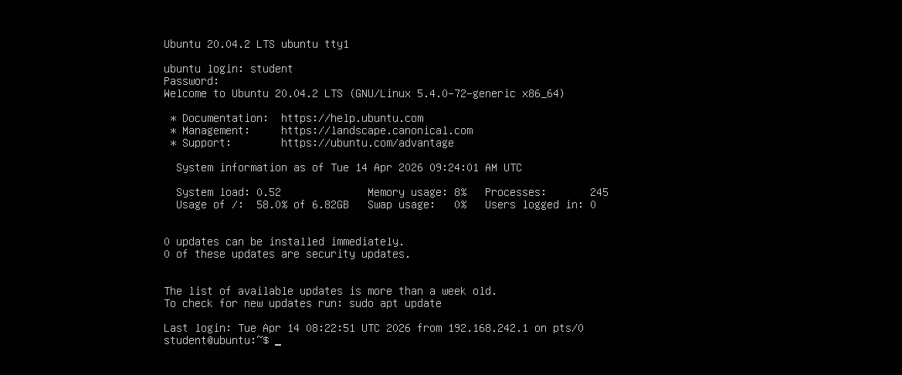 

- First I backed up to the root directory and ran `ls -la` to see all the directories, but after few commands I noticed this machine didn't let me to scroll up, scroll down or operate with the CLI:

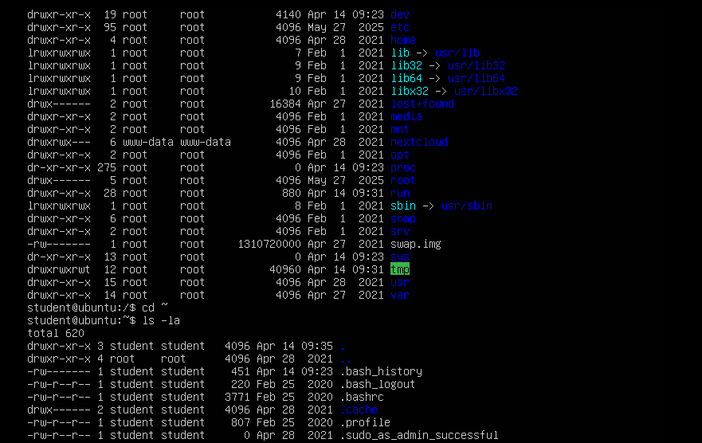

- So I tried to establish a SSH connection from my local machine for easier access. But first, let's take a look at the last line of the above picutre, as you can see, there's a hidden file named `.sudo_as_admin_successful`. This suggested that the user `student` has at least one time to run command as `root` priviledge in the past.
- Since I got the password of `student`, I try to escalate priviledge to be able to investigate all files in the machine by running:
 
```bash
student@ubuntu:~$ sudo su
[sudo] password for student:
```

- After getting the root priviledge, I established a SSH connection:
1. First, I need to request an IP address for my virtual machine, make sure running `ip a` first to get the card's name:

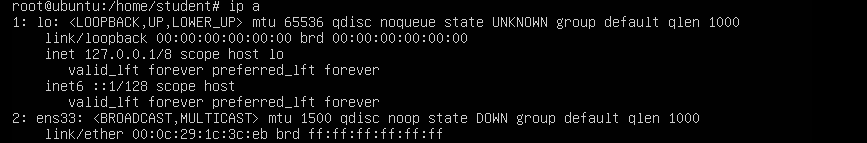

2. After getting the name as `ens33`, I can request for an IP address:
```bash
ip link set ens33 up
dhclient ens33 
```

3. After the virtual machine got an IP address, I ran `ip a` again to identify it, in my case it was `192.168.242.130`, now I could set up a SSH connection:
```bash
apt install openssh-server -y
systemctl start ssh
systemctl enable ssh
```
4. Then, returned to my host machine WSL to establish connection:
```bash
ssh student@192.168.242.130
``` 
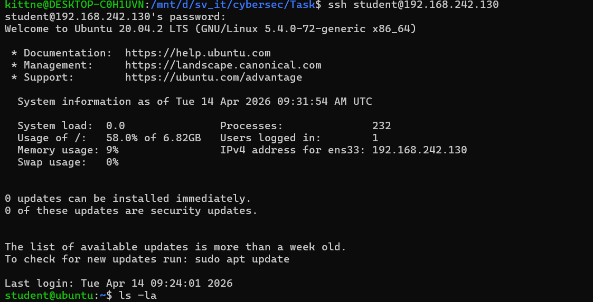

- So I got more space and started to really investigate the machine.

### EXPLOITATION PHASE ###
- In the home directory, I tried to see if the attacker ran something in cmd:

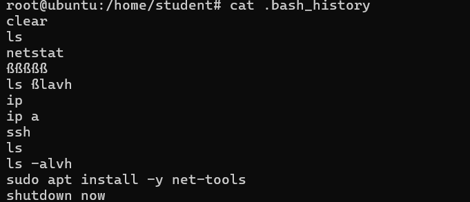

- As you can see, the attacker also tried to establish a ssh connection by running `ip a` and install `net-tools`
- But honetsly, I didn't find anything more interesting, so I looked for the `var/log` to analyze the log of the machine:
```bash
root@ubuntu:/home/student# ls -la /var/log/
total 3868
drwxrwxr-x  11 root      syslog            4096 Apr 14 09:23 .
drwxr-xr-x  14 root      root              4096 Apr 27  2021 ..
-rw-r--r--   1 root      root                 0 May 27  2025 alternatives.log
-rw-r--r--   1 root      root             22773 Apr 28  2021 alternatives.log.1
-rw-r-----   1 root      adm                  0 May 27  2025 apport.log
-rw-r-----   1 root      adm               2971 Apr 27  2021 apport.log.1
drwxr-xr-x   2 root      root              4096 May 27  2025 apt
-rw-r-----   1 syslog    adm              13150 Apr 14 09:37 auth.log
-rw-r-----   1 syslog    adm               5102 Apr 14 07:15 auth.log.1
-rw-r-----   1 syslog    adm                716 May 27  2025 auth.log.2.gz
-rw-r--r--   1 root      root            104003 Feb  1  2021 bootstrap.log
-rw-rw----   1 root      utmp               384 Apr 14 07:16 btmp
-rw-rw----   1 root      utmp                 0 May 27  2025 btmp.1
-rw-r--r--   1 syslog    adm             683759 Apr 14 09:23 cloud-init.log
-rw-r-----   1 root      adm              27296 Apr 14 09:23 cloud-init-output.log
drwxr-xr-x   2 root      root              4096 Jan 19  2021 dist-upgrade
-rw-r--r--   1 root      adm             127771 Apr 14 09:23 dmesg
-rw-r--r--   1 root      adm             128297 Apr 14 08:20 dmesg.0
-rw-r--r--   1 root      adm              25110 Apr 14 07:15 dmesg.1.gz
-rw-r--r--   1 root      adm              14335 May 27  2025 dmesg.2.gz
-rw-r--r--   1 root      adm              14300 May 27  2025 dmesg.3.gz
-rw-r--r--   1 root      adm              14207 May 27  2025 dmesg.4.gz
-rw-r--r--   1 root      root                 0 Apr 28  2021 dpkg.log
-rw-r--r--   1 root      root             32064 Apr 28  2021 faillog
drwxr-xr-x   3 root      root              4096 Apr 27  2021 installer
drwxr-sr-x+  4 root      systemd-journal   4096 Apr 27  2021 journal
-rw-r-----   1 syslog    adm             323651 Apr 14 09:31 kern.log
-rw-r-----   1 syslog    adm             328841 Apr 14 07:15 kern.log.1
-rw-r-----   1 syslog    adm              82378 May 27  2025 kern.log.2.gz
drwxr-xr-x   2 landscape landscape         4096 Apr 27  2021 landscape
-rw-rw-r--   1 root      utmp            292584 Apr 14 09:31 lastlog
drwxr-xr-x   2 root      adm               4096 May 27  2025 nginx
drwxr-xr-x   2 root      www-data          4096 Apr 27  2021 php
drwx------   2 root      root              4096 Feb  1  2021 private
-rw-r-----   1 syslog    adm             973587 Apr 14 09:55 syslog
-rw-r-----   1 syslog    adm             469440 Apr 14 07:15 syslog.1
-rw-r-----   1 syslog    adm             132364 May 27  2025 syslog.2.gz
-rw-------   1 root      root                 0 Feb  1  2021 ubuntu-advantage.log
drwxr-x---   2 root      adm               4096 May 27  2025 unattended-upgrades
-rw-------   1 root      root               717 Apr 14 09:23 vmware-network.1.log
-rw-------   1 root      root               697 Apr 14 08:20 vmware-network.2.log
-rw-------   1 root      root               717 Apr 14 01:09 vmware-network.3.log
-rw-------   1 root      root               697 Apr 14 07:15 vmware-network.4.log
-rw-------   1 root      root               697 Apr 14 09:23 vmware-network.log
-rw-------   1 root      root              2324 Apr 14 09:23 vmware-vmsvc-root.1.log
-rw-------   1 root      root              2324 Apr 14 01:09 vmware-vmsvc-root.2.log
-rw-------   1 root      root              1447 Apr 14 09:23 vmware-vmsvc-root.log
-rw-------   1 root      root               522 Apr 14 09:23 vmware-vmtoolsd-root.log
-rw-rw-r--   1 root      utmp            301824 Apr 14 09:31 wtmp
``` 
- There are three system logs that we need to focus on `syslog`, `syslog.1`, `syslog.2.gz`, I copied these logs to my local machine to investigate further. Moreover, I cross-referenced with the hint `binary exploitation`, inspected the log directory closer, I could see 2 suspicious application logs named `nginx` and `php`, I also copied logs in these folders.

- I did a small research about `nginx` first, I knew it's a web server responsible for handling incoming HTTP requests and forwarding them to backend services. In `nginx` directory, `error.log.1` caught my eyes, so I used `cat` to see what error the web server faced up with:

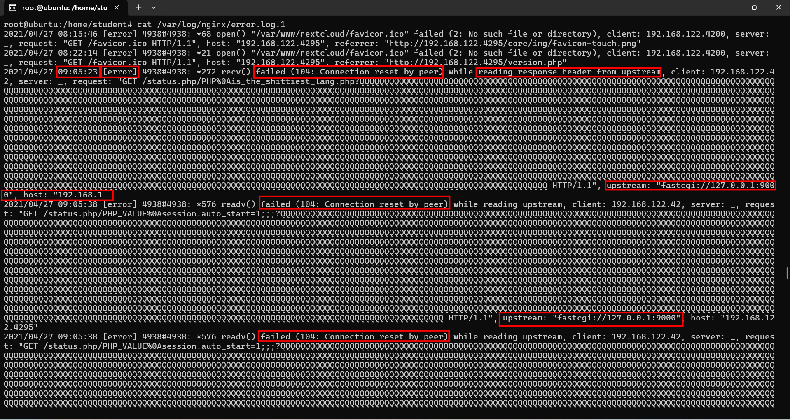

- I noticed a highly suspicious pattern: multiple `recv()` failed (104: Connection reset by peer) errors occurring while `nginx` was trying to read responses from the upstream. Moreover, there were a lot of letter `Q` in the payload, first I didn't know what they were so let's they sink here a bit.

- However, let's take a closer look at the upstream `url`: `fastcgi://127.0.0.1:9000`, so I tried to investigate what service was running on this IP and port. And in the `.bash_history`, I knew that the attacker had installed `net-tools` so I could use this tool to check this, however, when I couldn't use net-tools since the system told me to install it first. So I was thinking that the attacker had deleted the tool after using it, the best move here was to check `/var/log/apt/history.log.1` to see if it was actually deleted:

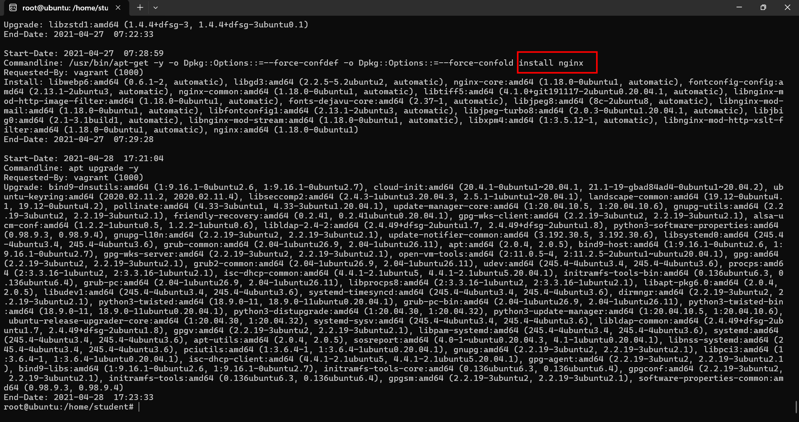

- However I neither saw the delete command, nor the install command, the only thing I saw was the command line to install `nginx`. That was weird, however let's put this beside, I could still use another tool named `ss - socket statistics`:

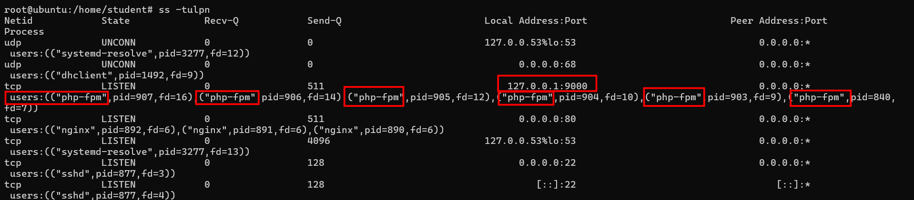

- I confirmed that port 9000 was specifically assigned to the `php-fpm` process. The fact that the upstream connection was reset suggested that the `php-fpm` process might have terminated. To verify this, I returned to the `syslog` to check for any service failure:

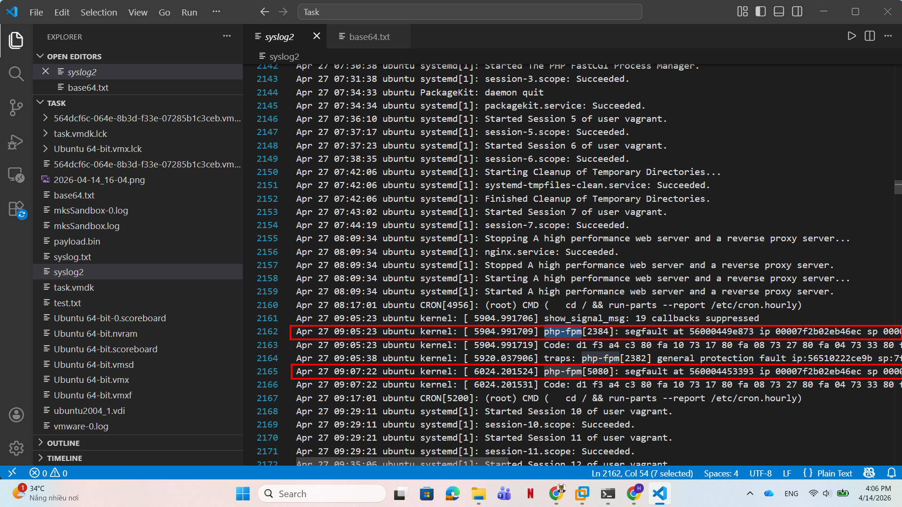

- As you can see, there were 2 segfaults made by `php-fpm` at `April 27 09:05:23` and `April 27 09:07:22`. cross-referencing with the hint `binary exploitation`, I could also identified that there were some crash files in the attacker pwn process, this was lied in `/var/crash`:

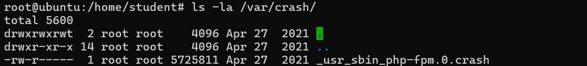

- As you can see, there's a crash file named `_usr_sbin_php-fpm.0.crash`. It suggested us that the crash come from `/usr/sbin/php-fpm`:

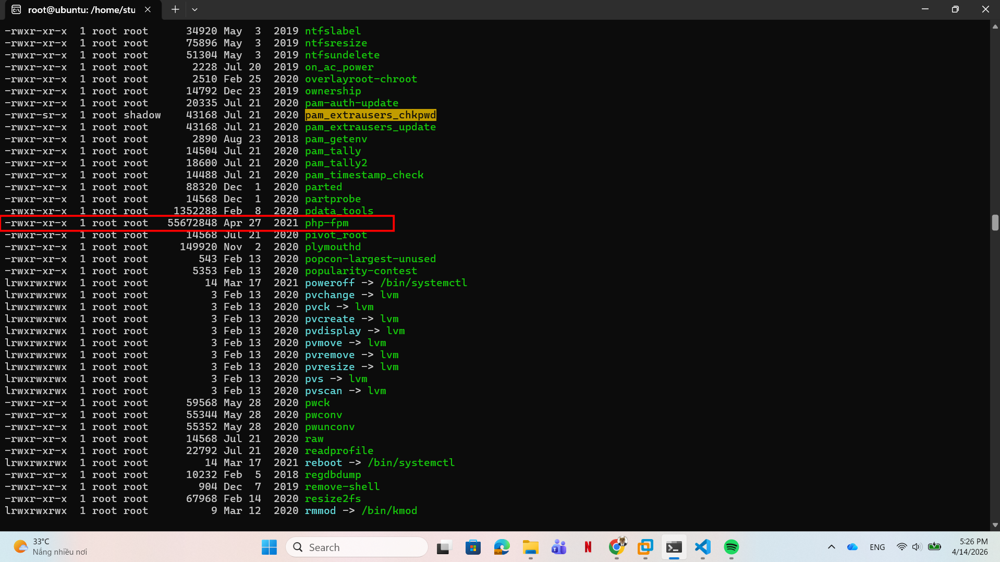

- This matched our hypothesis, so now I knew the attacker tried to exploit on php-fpm with a lot of letters `Q` sent in the upstream. After a research, this is `CVE-2019-11043`:

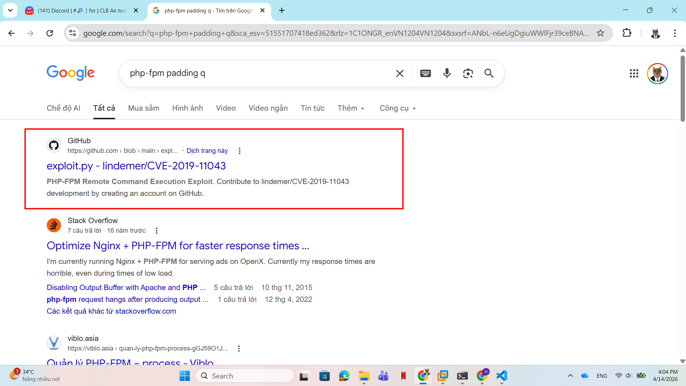

- According to the documentation, this vulnerability allows the attacker to underflow the memory and overwrite `PHP_VALUE` configurations. By doing so, the attacker could inject a persistent backdoor into `/status.php`, configuring it to execute system commands passed through the `?a=` parameter.

### POST EXPLOITATION PHASE ###
- Now let's deal with the `access.log.1` in `/var/log/nginx`, since I got the timestamp the attacker tried to pwn the process, I could narrow down the search range:

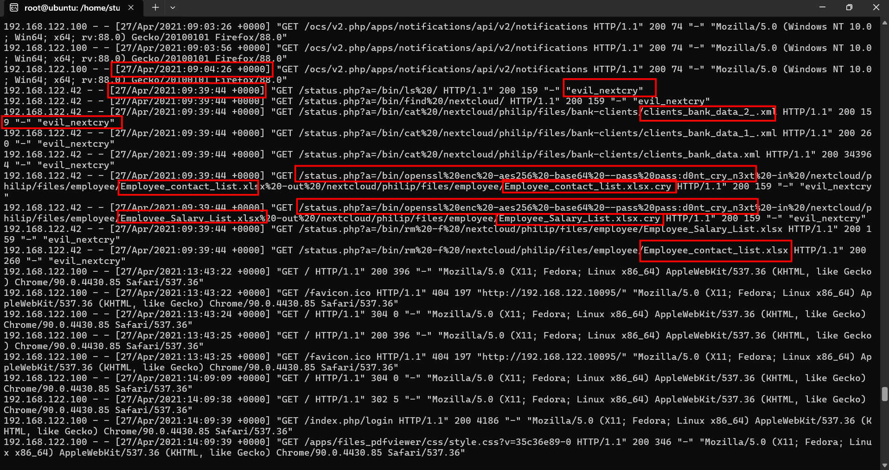

- From `09:04:26` there was a blank in timeline since this was the time attacker failed to pwn through php-fpm. He only succeeded and gained `RCE` after `09:39:44`

- With RCE confirmed, I traced the attacker's post-exploitation activities. It was clear he had successfully planted a `web shell` in `/status.php`, executing system commands through the `?a=` parameter. Moreover, he also operated under an `User-Agent` string named `evil_nextcry`:

  1. **Reconnaissance:** The attacker started by exploring the file system by executing `/bin/ls` and `/bin/find /nextcloud/` to list the directory structure and locate the valuable data
  2. **Data exfiltration:** After locating the data, the attacker immediately exfiltrated them. He used `/bin/cat` to read and dump several `.xml` files: `clients_bank_data_1_.xml`, `clients_bank_data_2_.xml`, and `clients_bank_data.xml`. 
  3. **Encrypting & Ransomware:** The attacker then used `openssl` to encrypt employee spreadsheets which were `Employee_contact_list.xlsx` and `Employee_Salary_List.xlsx` into `.cry` files using AES-256 encryption before converting to `base64` format. After that, he followed up with `/bin/rm -f` commands to delete the original files.

- However, since the attacker executed the openssl command through an `HTTP GET request` to their shell, the encryption key was written in plaintext in the log.

- There was a parameter looked like this `--pass pass:d0nt_cry_n3xt`, which helped me to extract the password: `d0nt_cry_n3xt`. With this key, we can easily reverse the encryption recover the deleted files.

- To do this, we can use the exact encrypt process of the attcker with the `-d` parameter which stands for decrypt:
```bash
openssl enc -d -aes256 -base64 --pass pass:d0nt_cry_n3xt -in /nextcloud/philip/files/employee/Employee_Salary_List.xlsx.cry -out Employee_Salary_List.xlsx
openssl enc -d -aes256 -base64 --pass pass:d0nt_cry_n3xt -in /nextcloud/philip/files/employee/Employee_contact_list.xlsx.cry -out Employee_contact_list.xlsx
```

- After this point, I tried to recover the encrypted files, however I saw that these files were already recovered by someone:

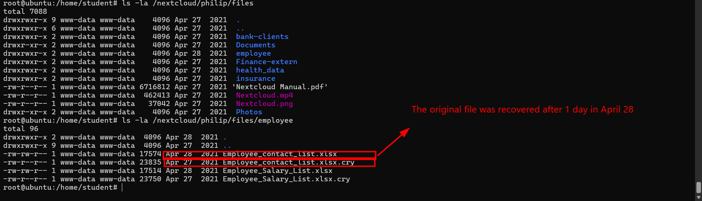

## 3. Conclusion ##
- Here the attack chain:
```text
                ------------------------------------------------------------
                │ PHASE 1: Initial Access                                  │
                │ - Target: nginx -> php-fpm port 9000                     │
                │ - Vulnerability: CVE-2019-11043                          │
                │ - Artifacts: 'Connection reset' from error nginx log,    │
                │   'segfault' from syslog, _usr_sbin_php-fpm.0.crash      │
                ------------------------------------------------------------
                                           |
                ------------------------------------------------------------
                │ PHASE 2: Persistence                                     │
                │ - Action: Planted web shell                              │
                │ - Access Vector: /status.php?a=[system_command]          │
                │ - Identification: User-Agent "evil_nextcry"              │
                ------------------------------------------------------------
                                           |
                ------------------------------------------------------------
                │ PHASE 3: Exfiltration                                    │
                │ - Action: Reconnaissance & Data exfiltration             │
                │ - Commands used: /bin/ls, /bin/find, /bin/cat            │
                │ - Files: 'clients_bank_data.xml'                         |
                │          'clients_bank_data_1.xml.'                      |
                |          'clients_bank_data_2.xml.'                      |
                ------------------------------------------------------------
                                           | 
                ------------------------------------------------------------
                │ PHASE 4: Ransomware                                      │
                │ - Action: Encrypted files & Destroyed originals          │
                │ - Tool: openssl using AES-256, base64 parameters         │
                │ - Password: 'd0nt_cry_n3xt'                              |
                │ - Destruction: /bin/rm -f                                │
                ------------------------------------------------------------
                                           | 
                ------------------------------------------------------------
                │ PHASE 5: Recovery                                        │
                │ - Action: Someone recovered encrypted files              │
                │ - Evidence: Unencrypted '.xlsx' files are dated in Apr 28│
                │   while the '.cry' files are dated in Apr 27             │
                ------------------------------------------------------------
```